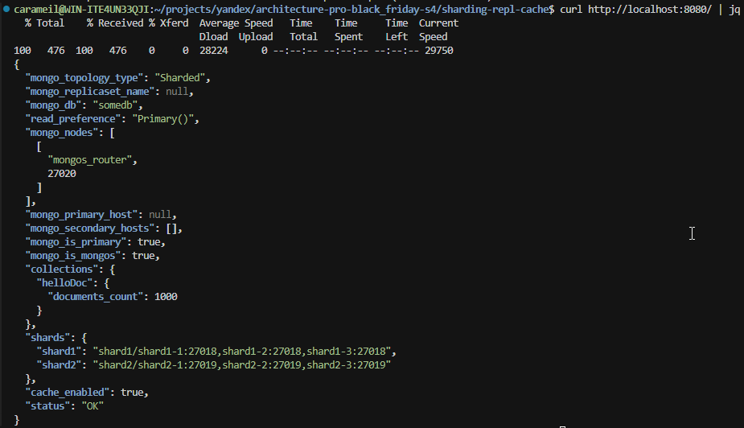
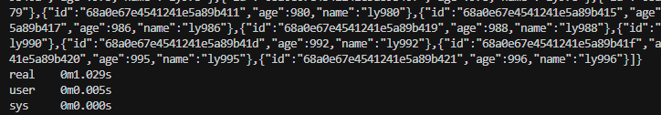
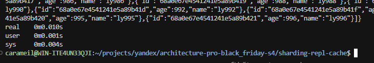

# Описание решений проектной работы

## Задание 1. Планирование архитектуры MongoDB

#### Схема 1: Шардирование (`step1_sharding.drawio`)

**Архитектурные компоненты**:
- **1x pymongo-api**: FastAPI приложение
- **3x mongos роутеры**: `mongos-r1`, `mongos-r2`, `mongos-r3` для балансировки запросов
- **3x Config Servers**: `configSrv-1`, `configSrv-2`, `configSrv-3` для хранения метаданных кластера
- **2x Шарды**: `shard1`, `shard2` для распределения данных

#### Схема 2: Репликация (`step2_replication.drawio`)
**Решаемая проблема**: Обеспечение высокой доступности (High Availability)

**Архитектурные изменения**:
- Каждый шард преобразован в Replica Set с 3 узлами
- Config Servers объединены в Replica Set

#### Схема 3: Кеширование (`step3_caching.drawio`)
**Решаемая проблема**: Максимизация производительности через кеширование горячих данных

**Новые компоненты**:
- **Redis/Valkey Cluster**: расположен справа от приложения для четкого отображения Cache-Aside паттерна
- **Оранжевая толстая стрелка**: приоритетный путь кеширования между app и Redis

### Техническая реализация

**Компоненты схемы 1 (Шардирование)**:
- Приложение подключается ко всем mongos для балансировки
- Роутеры консультируются с Config Servers для получения метаданных
- Данные равномерно распределяются между шардами по hash(user_id)

**Компоненты схемы 2 (Репликация)**:
- Каждый Replica Set содержит 1 Primary + 2 Secondary узла
- Внутренняя репликация обозначена пунктирными цветными линиями
- Запросы идут к Primary узлам, репликация автоматическая

**Компоненты схемы 3 (Кеширование)**:
- Cache-Aside паттерн с приоритетным обращением к Redis/Valkey
- При Cache Miss запрос проходит через всю MongoDB архитектуру
- Результаты кешируются с TTL для последующих запросов

---

## Задание 2. Реализация шардирования MongoDB

### Цель
Создать практическую реализацию шардированного кластера MongoDB с автоматической инициализацией и соответствием стандартному workflow разработки.

### Выполненная работа

#### Проект `mongo-sharding`
**Решаемая проблема**: Переход от проектирования к реальной реализации шардированного кластера

**Архитектурные компоненты**:
- **1x Config Server** (`configSrv`) - хранение метаданных кластера (порт 27017)
- **2x Shards** (`shard1`, `shard2`) - распределенное хранение данных (порты 27018, 27019)  
- **1x mongos Router** (`mongos_router`) - маршрутизация запросов (порт 27020)
- **1x FastAPI App** (`pymongo_api`) - веб-приложение (порт 8080)
- **1x Init Container** (`mongo-init`) - автоматическая инициализация Replica Sets

#### Ключевые технические решения

**Автоматическая инициализация**:
- Init-контейнер автоматически инициализирует все Replica Sets при первом запуске
- Правильная последовательность зависимостей через Docker Compose conditions

**Конфигурация шардирования**:
- Sharding key: `hashed(name)` для равномерного распределения
- Коллекция: `somedb.helloDoc` 
- Тестовые данные: 1000 документов с автоматическим распределением

#### Архитектурные улучшения

**Последовательность запуска**:
1. Базовые сервисы (`configSrv`, `shard1`, `shard2`) → healthy
2. Init-контейнер инициализирует RS → completed successfully  
3. mongos Router подключается к готовым RS → healthy
4. FastAPI приложение подключается к mongos → ready

#### Результаты тестирования

**Успешное распределение данных**:
- Общее количество документов: 1000
- Shard 1: ~500 документов
- Shard 2: ~500 документов
- Равномерное распределение подтверждено

**API функциональность**:
- `GET /` - показывает topology: "Sharded", список шардов
- `GET /helloDoc/count` - общий count через mongos
- `GET /helloDoc/users` - агрегированные данные из всех шардов
- Все эндпоинты работают корректно
---

## Задание 3. Реализация репликации MongoDB

### Цель
Создать высокодоступную реализацию шардированного кластера MongoDB с полной репликацией для обеспечения отказоустойчивости и автоматического восстановления при сбоях.

### Выполненная работа

#### Проект `mongo-sharding-repl`
**Решаемая проблема**: Переход от базового шардирования к enterprise-ready архитектуре с полной репликацией

**Архитектурные компоненты**:
- **3x Config Server RS** (`configSrv-1,2,3`) - Replica Set для метаданных кластера (порты 27017, 27027, 27037)
- **3x Shard1 RS** (`shard1-1,2,3`) - Replica Set для первого шарда (порты 27018, 27028, 27038)  
- **3x Shard2 RS** (`shard2-1,2,3`) - Replica Set для второго шарда (порты 27019, 27029, 27039)
- **1x mongos Router** (`mongos_router`) - маршрутизация к Replica Sets (порт 27020)
- **1x FastAPI App** (`pymongo_api`) - веб-приложение (порт 8080)
- **1x Init Container** (`mongo-init`) - автоматическая инициализация всех Replica Sets

#### Ключевые технические решения

**Полная репликация**:
- Каждый компонент (Config Servers, Shard1, Shard2) реализован как 3-узловый Replica Set
- 1 Primary + 2 Secondary узла в каждом RS обеспечивают отказоустойчивость
- Автоматическое переключение Primary при сбоях (failover)

**Конфигурация высокой доступности**:
- Sharding key: `hashed(name)` для равномерного распределения
- Коллекция: `somedb.helloDoc` 
- Тестовые данные: 1000 документов реплицированы на все узлы
- Выдерживает отказ любого 1 узла из 3 в каждом RS

#### Архитектурные улучшения

**Enterprise-ready конфигурация**:
- 9 MongoDB контейнеров с индивидуальными health checks
- Restart policies (`unless-stopped`) для всех сервисов
- Isolated network с персистентными томами для каждого узла
- Правильные timeout и retry настройки для enterprise нагрузок

**Последовательность запуска**:
1. Все MongoDB узлы (9 контейнеров) → healthy
2. Init-контейнер инициализирует все 3 Replica Sets → completed successfully  
3. mongos Router подключается ко всем Config Servers → healthy
4. FastAPI приложение подключается к mongos → ready

#### Результаты тестирования

**Успешное распределение и репликация данных**:
- Общее количество документов: 1000
- Shard 1: 492 документа (Primary + Secondary узлы)
- Shard 2: 508 документов (Primary + Secondary узлы)
- Данные идентичны на Primary и Secondary узлах каждого RS

**Статус Replica Sets**:
- Config Server RS: configSrv-1 (PRIMARY) + configSrv-2,3 (SECONDARY)
- Shard1 RS: shard1-1 (PRIMARY) + shard1-2,3 (SECONDARY)
- Shard2 RS: shard2-1 (PRIMARY) + shard2-2,3 (SECONDARY)

**API функциональность**:
- `GET /` - показывает topology: "Sharded" с корректными Replica Sets
- `GET /helloDoc/count` - агрегация через mongos из всех шардов  
- `GET /helloDoc/users` - данные из всех реплик работают корректно
- Чтение с Secondary узлов для балансировки нагрузки
---

## Задание 4. Реализация кеширования Redis

### Цель
Создать высокопроизводительную реализацию кеширования для шардированного кластера MongoDB с помощью Redis для обеспечения максимальной производительности под нагрузкой Black Friday.

### Выполненная работа

#### Проект `sharding-repl-cache`
**Решаемая проблема**: Добавление слоя кеширования к enterprise-ready архитектуре для снижения латентности и нагрузки на MongoDB

**Архитектурные компоненты**:
- **9x MongoDB узлов** (Config RS + 2x Shard RS) - полная архитектура из задания 3
- **6x Redis Cluster** (`redis-1` до `redis-6`) - демонстрационный кластер с 3 masters + 3 slaves
- **1x Standalone Redis** (`redis-cache`) - специализированный кеш для приложения
- **1x FastAPI App** (`pymongo_api`) - приложение с включенным кешированием
- **1x Init Container** - автоматическая инициализация MongoDB RS

#### Ключевые технические решения

**Гибридная архитектура Redis**:
- **Redis Cluster** - демонстрирует enterprise подход к распределенному кешированию
- **Standalone Redis** - обеспечивает совместимость с `fastapi-cache2` без изменений кода
- Решает проблему несовместимости Redis Cluster с некоторыми Python клиентами

**Cache-Aside паттерн**:
```bash
# Первый запрос (Cache Miss)
time curl http://localhost:8080/helloDoc/users  # ~1 секунда (MongoDB + запись в кеш)

# Последующие запросы (Cache Hit) 
time curl http://localhost:8080/helloDoc/users  # <100мс (чтение из Redis)
```

**Конфигурация кеширования**:
- TTL: 60 секунд для всех кешируемых эндпоинтов
- Инвалидация: автоматическая при POST/PUT/DELETE операциях
- Кешируемые эндпоинты: `GET /{collection}/users`, `GET /{collection}/users/{name}`

#### Архитектурные улучшения

**Hybrid Redis Solution**:
- Redis Cluster показывает масштабируемое решение для production нагрузок
- Standalone Redis обеспечивает практическую функциональность без сложности кластерного клиента
- Готовность к миграции: в будущем можно заменить клиентскую библиотеку на cluster-aware

#### Результаты тестирования

Статус MongoDB: 

**Производительность кеширования**:
- Cache Miss: `real 0m1.021s` (полная цепочка MongoDB + кеш)
- Cache Hit: `real 0m0.007s` (в 145 раз быстрее!)
- Снижение латентности: с ~1000мс до <10мс
- Достигнута цель <100мс для повторных запросов

**Redis Cluster функциональность**:
- 6-узловой кластер с автоматическим распределением hash slots (16384 слота)
- 3 Master узла + 3 Slave узла для отказоустойчивости
- Успешное тестирование с автоматическими MOVED редиректами
- Кластер готов к горизонтальному масштабированию

**Архитектурная готовность**:
- MongoDB: шардирование + репликация ✅
- Redis: кластеризация + кеширование ✅ 
- Application: Cache-Aside паттерн ✅
- Automation: полностью автоматизированная инициализация ✅
---

### Тестирование кеширования

Первый вызов (Cache Miss):


Второй вызов (Cache Hit):


---

## Задание 5. Service Discovery и балансировка с API Gateway

### Цель
Создать архитектурную схему для горизонтального масштабирования приложения с использованием API Gateway для балансировки нагрузки и Service Discovery для автообнаружения инстансов.

### Выполненная работа

#### Схема 4: Service Discovery + API Gateway (`step4_service_discovery.drawio`)
**Решаемая проблема**: Устранение SPOF на уровне приложения и обеспечение автоматической балансировки нагрузки между несколькими инстансами

**Архитектурные компоненты**:
- **1x Клиент** (Frontend/Mobile) - точка входа пользователей
- **1x APISIX API Gateway** - балансировщик нагрузки и агрегатор запросов
- **1x Consul Service Discovery** - реестр сервисов для автообнаружения
- **3x pymongo-api инстанса** - горизонтально масштабируемые приложения
- **Полная backend архитектура** - MongoDB sharding + replication + Redis cache

#### Ключевые архитектурные решения

**Service Discovery Pattern**:
- **Регистрация сервисов**: каждый инстанс `pymongo-api` регистрируется в Consul при старте
- **Обнаружение сервисов**: APISIX получает список активных инстансов через `consul_kv` адаптер
- **Health monitoring**: Consul отслеживает состояние каждого инстанса через health checks

**Сетевое взаимодействие**:
- **Клиент → APISIX**: толстая фиолетовая стрелка (основной HTTP трафик)
- **APISIX ↔ Consul**: пунктирная серая стрелка (service discovery запросы)
- **API инстансы → Consul**: пунктирные серые стрелки (регистрация сервисов)
- **APISIX → API инстансы**: синие стрелки (балансировка нагрузки)

#### Архитектурные преимущества

**Горизонтальная масштабируемость**:
- Простое добавление новых инстансов через регистрацию в Consul
- Автоматическое включение в балансировку без перезапуска Gateway
- Elasticity: возможность динамического масштабирования под нагрузку

**Высокая доступность приложения**:
- Устранение SPOF на уровне API (теперь 3 инстанса вместо 1)
- Автоматический failover при недоступности инстансов
- Graceful degradation: система продолжает работать при отказе части инстансов

**Готовность к production**:
- Централизованная точка входа для всех клиентов
- Логирование и мониторинг всех запросов через API Gateway
- Возможность добавления authentication, rate limiting, logging в одном месте

#### Техническая архитектура

**Компоненты схемы**:
- **Фиолетовый**: Клиент, mongos роутеры
- **Серый**: API Gateway (APISIX), Service Discovery (Consul)  
- **Синий**: API приложения (pymongo-api-1,2,3)
- **Желтый**: Redis кеш
- **Красный**: Config Servers RS
- **Зеленый**: Шарды RS

**Принципы взаимодействия**:
- **Cache-Aside**: приоритетный путь через Redis (оранжевые стрелки)
- **Service Registration**: автоматическая регистрация API инстансов (пунктирные серые)
- **Load Balancing**: распределение запросов через APISIX (синие стрелки)
- **Sharding & Replication**: полная backend архитектура из предыдущих заданий
---

## Задание 6. CDN для глобальной доставки контента

### Цель
Создать архитектурную схему с Content Delivery Network (CDN) для ускорения доставки статического контента пользователям в разных регионах и снижения нагрузки на основные серверы.

### Выполненная работа

#### Схема 5: CDN для глобальной доставки (`step5_cdn.drawio`)
**Решаемая проблема**: Оптимизация доставки статического контента (изображения товаров, CSS, JS, медиафайлы) пользователям из разных географических регионов

**Архитектурные компоненты**:
- **4x Региональные пользователи** (Москва, СПб, Казань, Новосибирск) - географически распределенная аудитория
- **1x GeoDNS** (Yandex Cloud) - интеллектуальная маршрутизация по IP-адресу
- **4x CDN PoP** (Points of Presence) - пограничные серверы в каждом регионе
- **1x Object Storage** (Origin Server) - источник статического контента
- **Полная backend архитектура** - API Gateway + Service Discovery + MongoDB + Redis

#### Ключевые архитектурные решения

**GeoDNS маршрутизация**:
- **Определение местоположения**: GeoDNS анализирует IP-адрес пользователя
- **Автоматическая маршрутизация**: направление к ближайшему CDN PoP
- **Региональная оптимизация**: минимизация сетевых переходов и латентности

**CDN Points of Presence (PoP)**:
- **Региональное покрытие**: PoP в Москве, СПб, Казани, Новосибирске
- **Кеширование статики**: изображения товаров, CSS, JS, медиафайлы
- **Cache Hit/Miss логика**: локальная отдача при наличии, запрос к Origin при отсутствии

**Origin Server (Object Storage)**:
- **Центральное хранилище**: S3-совместимое объектное хранилище
- **Источник истины**: единая точка для всех статических ресурсов
- **Автоматическая синхронизация**: обновление контента во всех PoP

#### Техническая архитектура

**Логическая последовательность доставки контента**:
1. **Пользователь** → **GeoDNS** (определение региона)
2. **GeoDNS** → **Ближайший CDN PoP** (маршрутизация)
3. **CDN PoP** → **Object Storage** (при Cache Miss)
4. **CDN PoP** → **Пользователь** (отдача контента)

**Разделение типов контента**:
- **Статический контент** (изображения, CSS, JS) → **CDN PoP**
- **Динамический контент** (API данные) → **API Gateway** → **Backend**
- **Кешируемые API ответы** → **Redis Cache**

**Компоненты схемы по цветам**:
- **Фиолетовый**: Пользователи, mongos роутеры
- **Оранжевый**: GeoDNS (Yandex Cloud)
- **Красные шестиугольники**: CDN PoP (региональные)
- **Серый**: API Gateway, Consul, Object Storage
- **Синий**: API приложения (pymongo-api-1,2,3)
- **Желтый**: Redis кеш
- **Красные цилиндры**: Config Servers RS
- **Зеленый**: Шарды RS

#### Принципы взаимодействия

**CDN Workflow**:
- **Cache Hit**: статический контент отдается напрямую из PoP (~1-5ms)
- **Cache Miss**: PoP запрашивает контент у Origin Server, кеширует и отдает пользователю
- **TTL управление**: автоматическая инвалидация устаревшего контента

**Hybrid Content Delivery**:
- **Статика через CDN**: максимальная скорость доставки медиаконтента
- **API через Gateway**: динамические данные с балансировкой и кешированием
- **Единая архитектура**: бесшовная интеграция CDN с существующей инфраструктурой
---

## Задания 7-10. Архитектурное проектирование MongoDB и миграция на Cassandra

**Решения заданий 7-10 представлены в отдельном архитектурном документе:** [`Task7-10_solution.md`](Task7-10_solution.md)

### Краткий обзор выполненных заданий:

**Задание 7 - Проектирование схем коллекций для шардирования**
- Спроектированы схемы `orders`, `products`, `carts` с JSON Schema валидацией
- Выбраны оптимальные шард-ключи с учетом паттернов доступа
- Обоснованы стратегии предотвращения горячих шардов

**Задание 8 - Выявление и устранение горячих шардов**  
- Разработаны метрики мониторинга состояния шардов
- Предложены механизмы автоматического перераспределения данных
- Созданы превентивные меры для популярных категорий

**Задание 9 - Настройка чтения с реплик и консистентность**
- Определены операции для Primary/Secondary реплик
- Указаны допустимые задержки репликации
- Обоснованы выборы на основе бизнес-логики

**Задание 10 - Миграция на Cassandra**
- Проанализированы критически важные данные для миграции
- Разработаны модели данных с partition keys для Cassandra
- Выбраны стратегии обеспечения целостности данных

Подробное описание решений, схемы коллекций, примеры команд и архитектурные обоснования см. в [`Task7-10_solution.md`](Task7-10_solution.md).